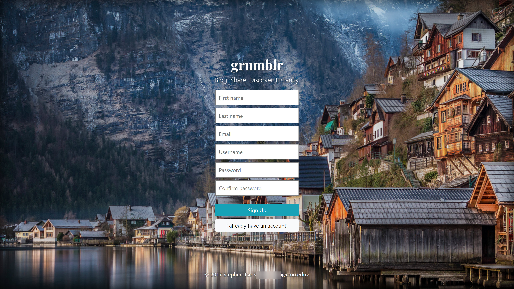
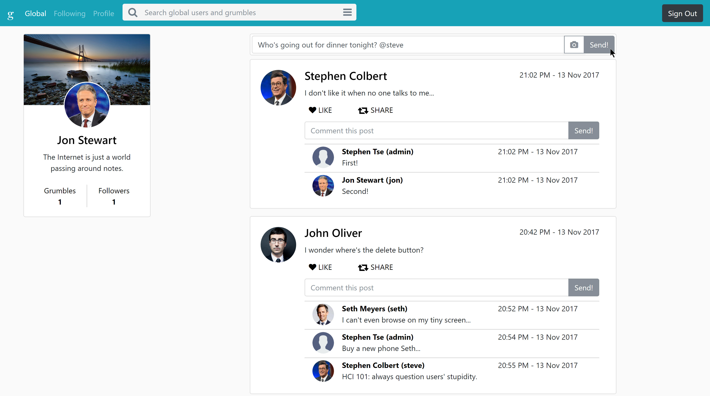
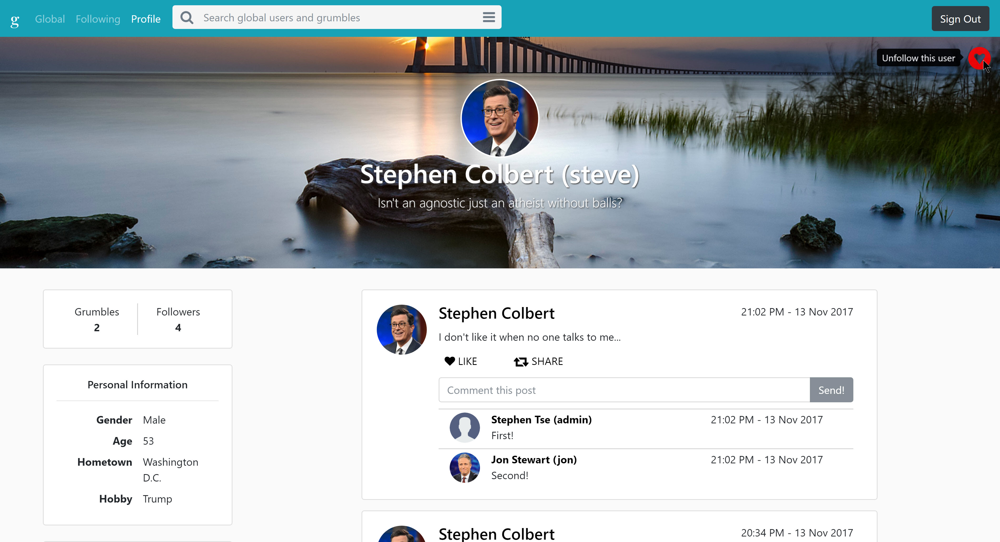
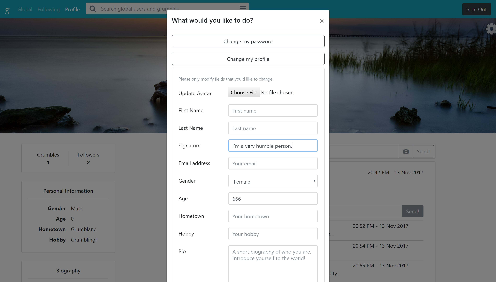
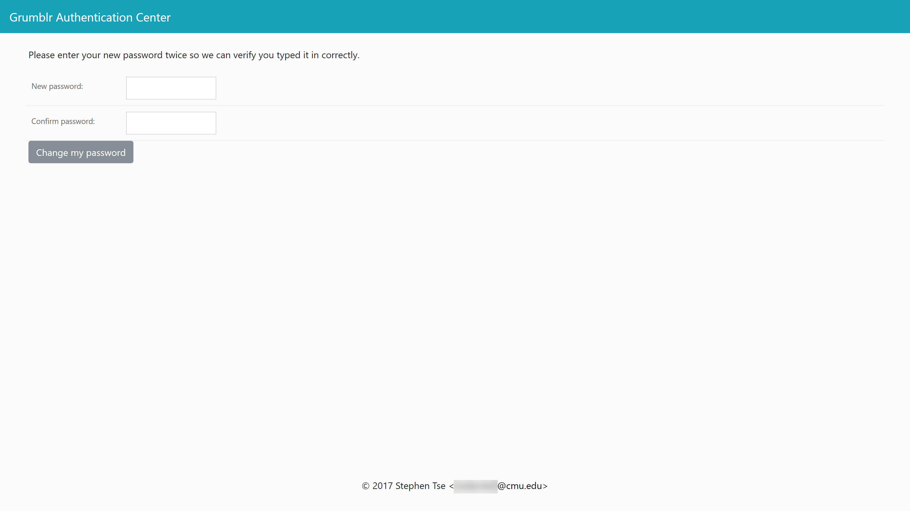

# gr***** - A full-stack micro-blogging website
**Author:** Stephen Xie  
**Project Version:** 6.0.0

gr***** is a Django-based full-stack micro-blogging website. It's a featureful, near-production-ready web application that supports user registration and authentication, email integration, photo upload, and dynamic quasi-real-time updates.

Detailed documentations to be added later.

**Quick note:** before someone mentions it again, yes I do know about the bad positioning of the follow / unfollow button ;p

**Another quick note:** I used the Django shell (`manage.py shell`) to test my models during development. I should have utilized the unit testing tools from Django to standardize and automate the testing process. My bad...

## Screenshots

## Pre-registered accounts

| Username | Password | Note                     |
|----------|----------|--------------------------|
| admin    | admin    | Is Project Administrator |
| jon      | jon      |                          |
| steve    | steve    |                          |
| seth     | seth     |                          |
| john     | john     |                          |
