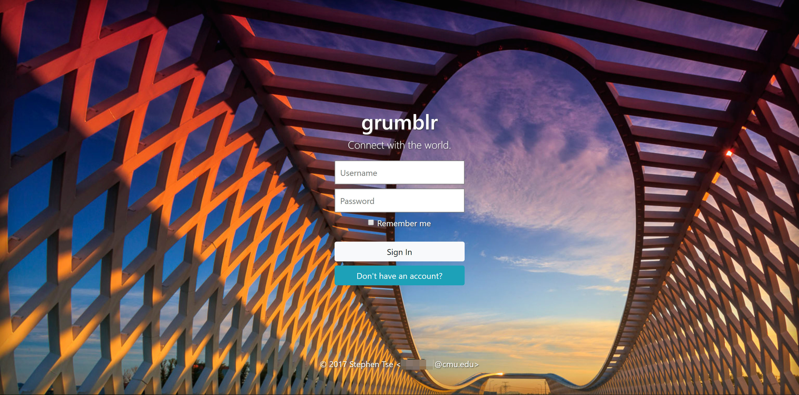
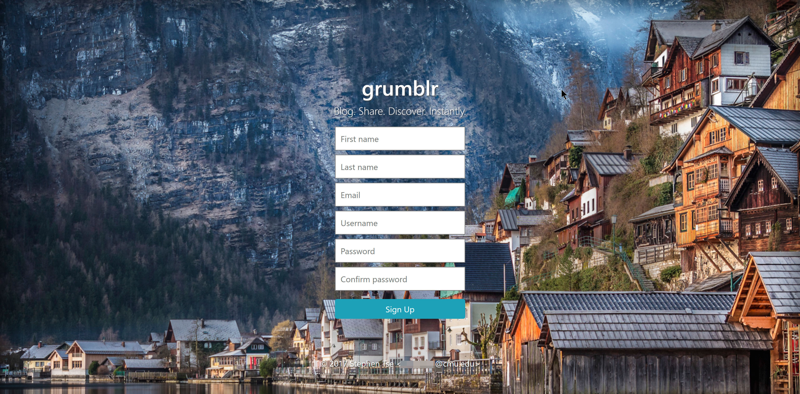
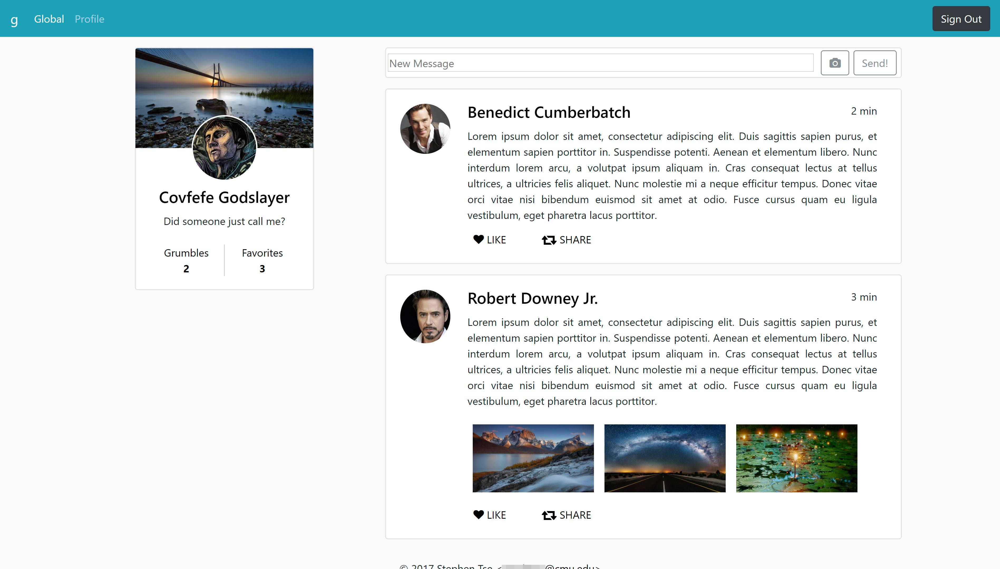
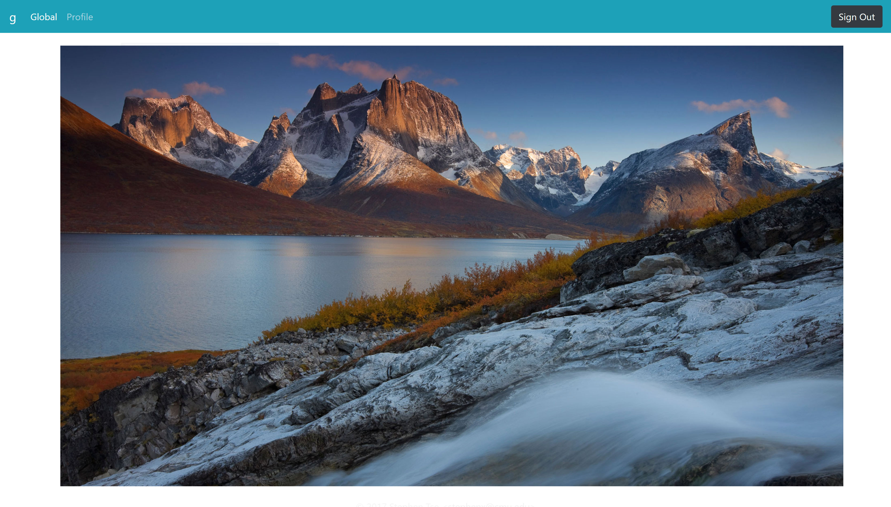
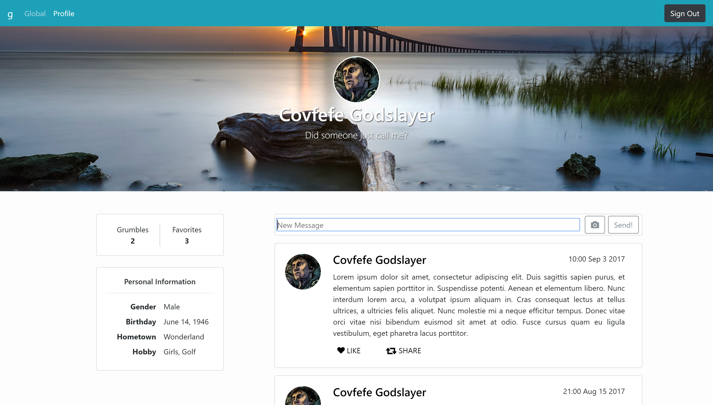

# gr***** Site Prototype
**Author:** Stephen Xie \<[redacted]@cmu.edu\>  
**Project Version:** 1.1.0

This is just a visual demonstration of what the nano-blogging site grumblr may look like according to the design drafts (drawn as wireframe diagrams in the `wireframes` directory). Most of the site functions are not working yet, and the visual design is not finalized (glitches and imperfections are to be expected). Nonetheless, it's still fun to play with!

To run the demo site, simply open `src\index.html` in a web browser (preferably Chrome / Firefox) to get started.

## Some Screenshots (As Of Version 1.1.0)

## Some Notes

1. The site is tested on Chrome and Firefox, so it should behave about the same in both Webkit and Gecko powered web browsers.

2. I haven't decided the site behavior on small sreen sizes. Right now elements in the global stream page and the profile page will stack up in small screens, but it's not an ideal solution. I'm considering abandoning auto resizing in the future.

3. The styling is not finished for the static demo. There's a known gitch in the registration page where the footer will float up to the input area in small screens. Also, I didn't apply any web fonts besides the default one to the site, and elements such as the message sending box are only styled roughly.

4. As mentioned earlier, most of the site functions don't work yet. Many of the clickable areas are just static links to other web pages or nowhere. Therefore, the static demo does not fully represent the current design of human-computer interations either.

## References

1. I consulted some of the examples provided by [Bootstrap](http://getbootstrap.com/docs/4.0/examples/) when I was developing the demo from the ground up: __Jumbotron__, __Fixed navbar__, __Album__ and __Cover__. Particularly, the dynamic resizing feature for the sign-in / registration pages is migrated from the implementations in __Cover__, but there're still a few tweaks to be done (see the visual glitch mentioned in Note #3).

2. The parallex picture scrolling effect in the profile page is from [cskelly](https://www.bootply.com/103783). It's a rather small yet super elegant jQuery script!

3. The icons used in the demo are from [Font Awesome](http://fontawesome.io/).
